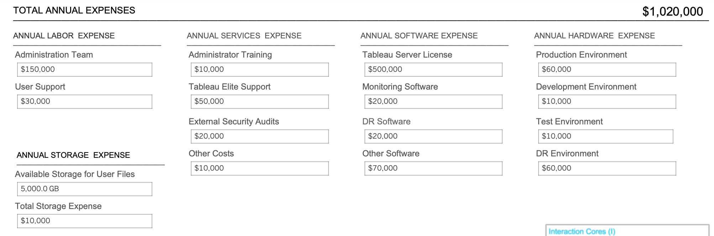
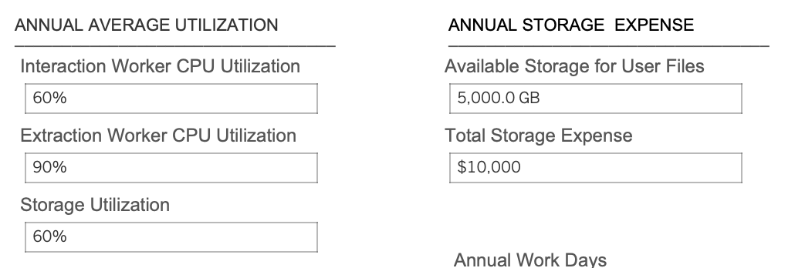
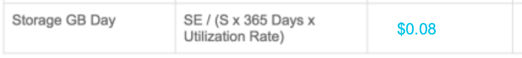
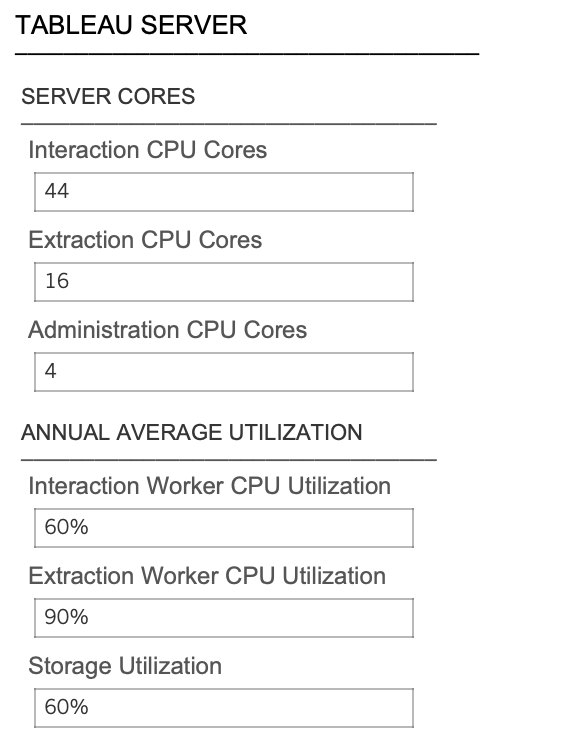
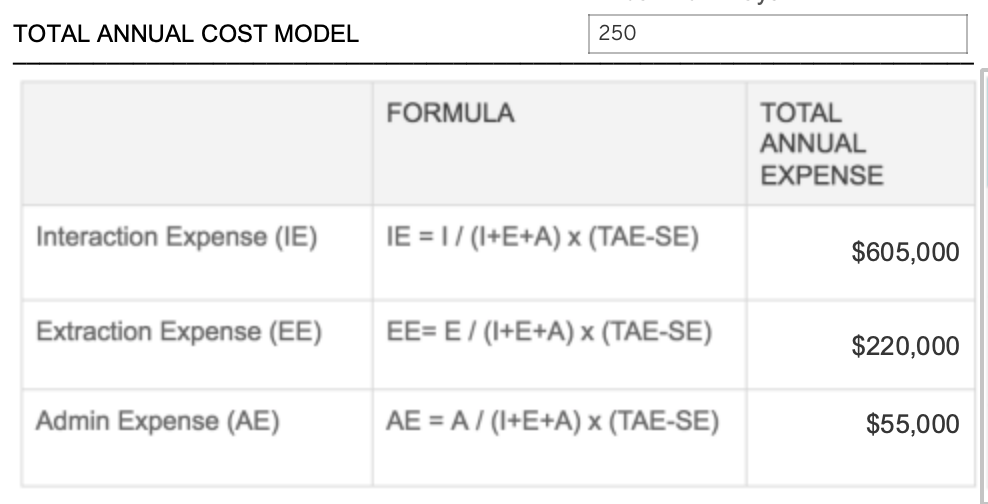
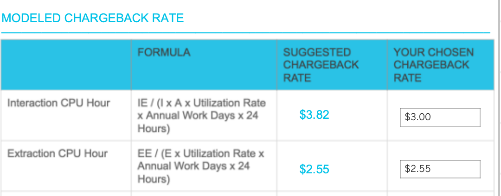
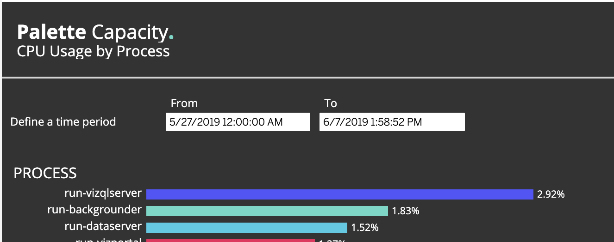

# Building initial Chargeback models for Tableau Server

In a modern enterprise, central infrastructure-related costs are managed by platform teams and _charged_ to functional teams using the infrastructure components. To have a fair _chareback model_, platform teams (PT) must calculate their TCO (total cost of ownership) along with the system usage by the individual teams.

In this document, we will explain how to calculate the first version of the chargeback model, which could be a basis for further versions, tailored to the specific organization's needs. 

## Calculating the TCO

When calculating the TCO, we should always calculate the costs of all environments, including development, sandbox, staging, and production. Even if we chargeback costs based on production usage, to run production workloads these systems are essential, and their costs must be incorporated into the total costs.

The TCO of the Tableau platform usually breaks down to the following buckets:

##### Annual Labor Expenses

These expenses include the Administration team's, monitoring team's and the user support team's annual costs for the platforms. 

##### Annual Storage Expense

The Annual Storage Expense is the total cost of storing files in the infrastructure, including all environments. However, we can only chargeback the storage used by end-users. Therefore, we need to add what is the maximum storage that users can utilize for storing their business contents such as workbooks and data sources, extracts, and so on. 

##### Annual Services Expense

All external services required to run the platform including trainings, elite support, security audits or other costs like performance optimization consultation. 

##### Annual Software Expense

The cost of software licenses required to run the services, including Tableau Server Licenses. 

##### Annual Hardware Expense

All hardware expenses for all environments.

Adding these numbers together, we should have our annual TCO, the basis for our chargeback model.

## Total Annual Cost Model

The next step is to break down our TCO to chargeable items. In the Tableau Server world, usually we chargeback three elements:

* **Interaction expense**: expense occurred when end users are viewing visualizations, publishing contents or interacting with AskData or Metrics. Interacting with the server is considered a CPU intensive task: every click on a dashboard calculates the load on the server. We consider vizqlserver and their child processes (hyper, data server) as interactive CPU consumption.
* **Batch expense:** expense occured when running background jobs including extracts, subscriptions or AskData indexing. Background costs can be calculated on the number of seconds a job occupies a backgrounder process or per CPU hour. Backgrounders are single-threaded applications, meaning that you cannot run more background jobs in parallel than the number of backgrounders deployed on the system. In our system we calculate Backgrounder CPU hour.
* **Storage expense:** expense related to storing user content.

In the next section, we will use the following abbreviations to explain these expenses and their rates:

**Interaction cores (I)** Number of cores dedicated to or _assumed_ for interaction

**Backgrounder cores (E)** Number of cores dedicated to or _assumed_ for batch processing

**Administration cores (A)** In the pre-`tsm`  era Tableau did not require CPU licenses for those administration nodes, where no vizql servers were running. In case of the system has workers configured without vizql nodes, these servers and their cores are assumed as administration cores.

**Storage volume:** Number of GB-s available for workbooks and data source files

**Annual Storage Expense:** Expense attributed to providing storage for workbooks and data source files

**Total Annual Expense:** Annual Labor Expense + Annual Software Expense + Annual Hardware Expense + Annual Services Expense + Annual Storage Expense

**CPU time** (or process **time**) is the amount of **time** for which a central processing unit (**CPU**) was used for processing instructions of a computer program or operating system. 

A **CPU Hour** is the equivalent of one hour's worth of 100% CPU time gone to a program. Since most programs do not receive anywhere near 100% CPU time, it takes usually more than hour. 

### Storage Expense Model

The optimal model for charging storage related costs to functional teams is:

$Storage\ GB\ per\ Day = \frac{SE} {(S \times 365\ days \times Utilization\ rate)}$

Where utilization rate equals the average utilization of the storage available for users. 

Considering the following infrastructure costs and utilization:

The suggested Storage GB Day rate (what is the cost to store one GB day for one day) calculates to $0.08.

### Calculating Interaction and Batch Expenses

To calculate Interactive and Batch expenses, we need to understand their total cost. To do this, we should understand how many CPU cores are allocated to each task (Batch and Interactive). In case the backgrounder servers are separated to dedicated workers, the calculation is fairly easy: 

* we know precisely what is the average utilization on the servers,
* we know the total cost of the Batch/Extraction expense
* we know that we need to charge for time used for these backgrounder cores as one backgrounder job occupies one backgrounder process running on one CPU core

Considering the following infrastructure, 

the calculation for Interaction and Extraction expenses are:

**Interaction Expense ($IE$)** equals to  $\frac{I} {(I+E+A)} \times (TAE-SE)  $ , where $\frac{I}{(I+E+A)}$ stands for CPU ratio for interaction processes. Please note that we subtract the storage expense $SE$ from $IE$, as storage was calculated previously with a different method.

Similarly, the **Batch or Extraction Expense ($EE$)** is $\frac{E} {(I+E+A)} \times (TAE-SE)$.  In case we have **admin expense ($AE$)**, - meaning that we have workers that do not participate either in batch or interactive loads - the formula is $\frac{A} {(I+E+A)} \times (TAE-SE)$.

Using these formulae, we have the following annual expenses for the above-specified infrastructure:

 

Using these numbers, we can easily assign rates to our unit of measures. **One Interactinon CPU Hour** will be $\frac {IE} {I} \times Utilization\ Rate \times \ Annual\ Work\ Days \times 24\ Hours $. Similarly, the Extraction or Backgrounder CPU hour will be $\frac {EE} {E} \times Utilization\ Rate \times \ Annual\ Work\ Days \times 24\ Hours $.

### Mixed Mode - No Backgrounder Segregation 

In case there are no dedicated workers for backgrounders, we should estimate the CPU consumption ratio between backgrounder and interactive sessions. 

Considering the following CPU breakdown, where `vizqlserver` used 682 hours of CPU time and `backgrounder` used 426 hours with total of on 80 worker cores, the number of interactive CPUs are: $80 \times \frac {682} {682 +426} \approx  49.24$ cores, while the number of backgrounder CPU cores are:  $80 \times \frac {426} {682 +426} \approx  30.75$.

In these cases, the CPU utilization numbers should be the same in the model for both backgrounder and interaction.

# Summary

By quantifying the total cost of ownership, system utilization, and resource consumptions platform teams can easily assign rates for the main consumption buckets (interaction, backgrounder, storage). While these numbers are just estimates, by leveraging Palette Chargeback's "what-if analysis" capabilities PTs can easily find the right numbers based on their actual consumptions.
